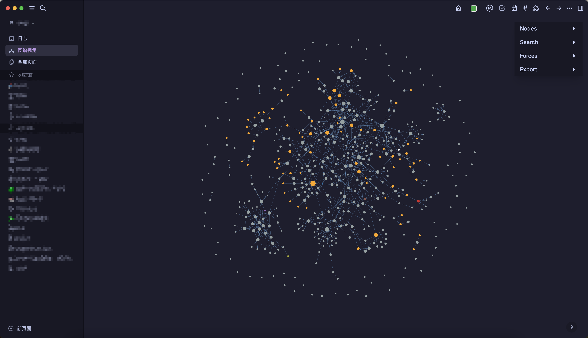
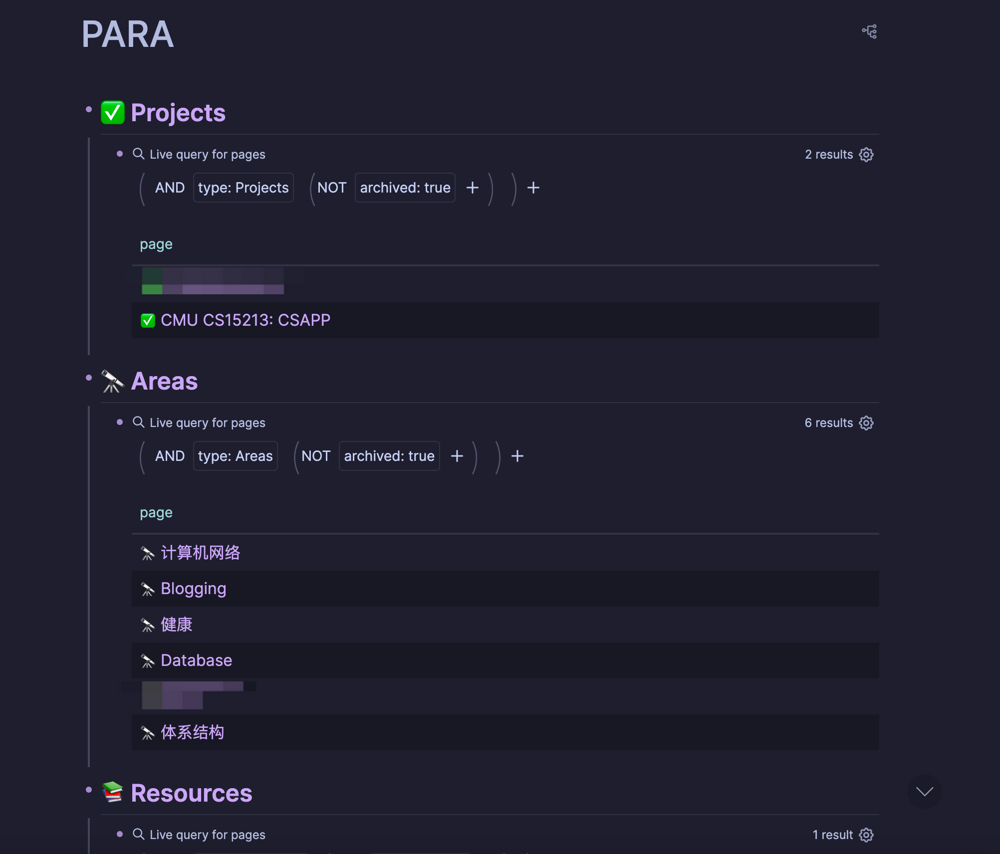

+++
title = "我的 Logseq 工作流"
date = 2024-03-02T14:47:13+08:00
draft = false
tags = ["logseq", "clojure", "gtd", "para"]
toc = true
+++

22 年底开始用 Logseq 记笔记，到现在一年多了，终于攒了一个「乱七八糟」的图谱：



## 先夸一夸

以前从来没有在一个笔记软件（或者 Markdown 编辑器）上坚持这么久。它给我的最大感觉就是无压记录，基本只需要写写日记，看似记得很乱，基本没有整理，但实际上我又能很轻松地在图谱里找到我要的东西。

Logseq 里没有「目录」的概念，所有 md 文件都放在 `pages/` 下。因为我有些洁癖，一旦有目录（不管是写代码还是写文档）我就得想很久，怎么去分类，好像某个文件既可以放这，又可以放那。

> 只要它不给我整理目录的机会，我就不会觉得它乱 😂

工作后，感觉也不再像学校里，书一本一本地学，笔记一章一章地记。更多的是碎片化的知识：

- 看到了一篇感兴趣的技术博客
- GitHub 上突然爆火的仓库
- 偶然在哪看的小工具
- ...

进入脑袋的知识本来就是乱的，也只能用「乱七八糟」的方式记在笔记里。

另外，最重要的一点，它是本地存储。现在好用的本地存储笔记软件基本也就 Logseq 和 Obsidian 了，选择 Logseq 纯个人喜好。

## GTD

> Getting Things Done

我是先自己在 Logseq 里摸索好用的 Tasks 流程，然后才知道 GTD 这套东西，结果发现好像也差不多（不用太纠结那些概念，适合自己最重要）。

我喜欢把 Tasks 分为四类：

- 🔨 NOW: 目前正在做的，或者今天就要过期的
- 🔥 OVERDUE: 已经过期的
- 📅 NEXT: 未来 10 天需要做的
  - 对应 GTD Lite[^1] 中的 Scheduled
- 🚧 UNPLANNED: 还没有计划的
  - 对应 GTD Lite[^1] 中的 Someday

[^1]: [GTD Lite - Workflowy guide](https://workflowy.com/systems/gtd-system-lite/)

这些可以用 Logseq Query 实现，展示在每天的日记下方:

```clojure
{:meta/version 1

 ;; ...

 :default-queries
 {:journals
  [{:title "🔨 NOW"
    :query [:find (pull ?b [*])
            :in $ ?today
            :where
            [?b :block/marker ?marker]
            (or-join [?b ?marker ?today]
                     (and
                      [(contains? #{"NOW" "LATER" "TODO" "DOING"} ?marker)]
                      (or-join [?b ?d]
                               [?b :block/deadline ?d]
                               [?b :block/scheduled ?d])
                      [(= ?d ?today)])
                     [(contains? #{"DOING" "NOW"} ?marker)])]
    :inputs [:today]
    :result-transform (fn [result]
                        (sort-by (fn [h]
                                   (get h :block/priority "Z"))
                                 result))
    :collapsed? false}
   {:title "🔥 OVERDUE"
    :query [:find (pull ?b [*])
            :in $ ?start ?today
            :where
            [?b :block/marker ?marker]
            [(contains? #{"NOW" "LATER" "TODO" "DOING"} ?marker)]
            (or-join [?b ?d]
                     [?b :block/deadline ?d]
                     [?b :block/scheduled ?d])
            [(>= ?d ?start)]
            [(< ?d ?today)]]
    :inputs [:-56d :today]
    :result-transform (fn [result]
                        (sort-by  (fn [h]
                                    [(get h :block/priority "Z")
                                     (or
                                      (get h :block/deadline)
                                      (get h :block/scheduled))])
                                  result))
    :collapsed? false}
   {:title "📅 NEXT"
    :query [:find (pull ?b [*])
            :in $ ?start ?next
            :where
            [?b :block/marker ?marker]
            [(contains? #{"LATER" "TODO"} ?marker)]
            (or-join [?b ?d]
                     [?b :block/deadline ?d]
                     [?b :block/scheduled ?d])
            [(>= ?d ?start)]
            [(< ?d ?next)]]
    :inputs [:+1d :+10d]
    :result-transform (fn [result]
                        (sort-by (fn [h]
                                   [(or
                                     (get h :block/deadline)
                                     (get h :block/scheduled))
                                    (get h :block/priority "Z")])
                                 result))
    :collapsed? true}
   {:title "🚧 UNPLANNED"
    :query [:find (pull ?b [*])
            :where
            [?b :block/marker ?marker]
            [(contains? #{"LATER" "TODO"} ?marker)]
            (not
             (or-join [?b]
                      [?b :block/deadline _]
                      [?b :block/scheduled _]))]
    :result-transform (fn [result]
                        (sort-by (fn [h]
                                   (get h :block/priority "Z"))
                                 result))
    :collapsed? true}]}

 ;; ...
 }
```

## PARA

> Projects, Areas, Resources, Archives
>
> 这部分我觉得是重点，如果只能做 Tasks 管理，那用 Logseq 还不如用滴答清单那种。

通常 GTD 会搭配一个 Projects 列表，然后我把 PARA 直接融合了进来（适合自己就好）。非常推荐简单看下 [Tiago Forte 的那篇博客](https://fortelabs.com/blog/para/)，我感觉区分清楚什么是 Projects 什么是 Areas 还是很重要的。

比如「学习数据库」，如果把它当成一个 Project，然后围绕它关联一堆 Task，我永远无法完成这个 Project，也永远无法确认它的进度。（缺少一个明确的目标）

正确的应该是，「数据库」作为一个 Area，然后某天我打算提升自己「数据库」相关的专业能力，开始学习 CMU15445，于是把「完成 CMU15445」作为一个和「数据库」关联的 Project。

事后，也可以很清晰地回顾，最近做了什么，学了哪些「数据库」相关的知识。



PARA 在 Logseq 的具体实现，也比较简单，基本就是给相关页面标记上 `type` (`[[Projects]]`, `[[Areas]]` ...)，然后在一个单独的页面聚合展示：

```md
- ## ✅ Projects
  - {{query (and (page-property :type [[Projects]]) (not (page-property :archived "true")))}}
    query-table:: true
    query-properties:: [:page]
- ## 🔭 Areas
  - {{query (and (page-property :type [[Areas]]) (not (page-property :archived "true")))}}
    query-table:: true
    query-properties:: [:page]
- ## 📚 Resources
  - {{query (and (page-property :type [[Resources]]) (not (page-property :archived "true")))}}
    query-properties:: [:page]
- ## 🗄️ Archives
  collapsed:: true
  - {{query (and (or (page-property :type [[Projects]]) (page-property :type [[Areas]]) (page-property :type [[Resources]])) (page-property :archived "true"))}}
    query-properties:: [:page :type]
    collapsed:: true
```

## 总结

适合自己最重要（应该是这篇文章第三遍表达这个观点了），上面的工作流我还没有介绍的很详细，只是提供了一个大概的思路，还是推荐简单看一下 GTD 和 PARA 相关的博客。
