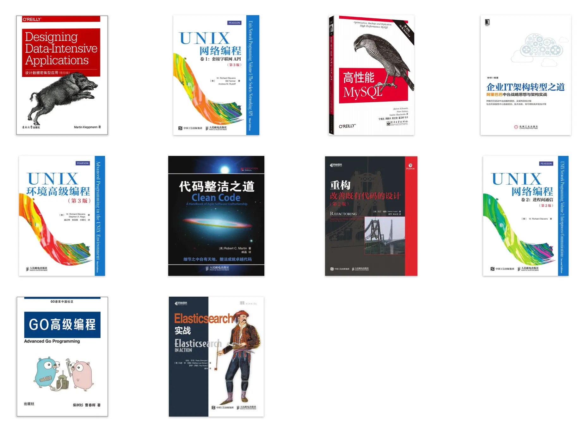

好久没写博客了，虽然也不知道在忙啥，反正感觉是一直在忙。要不是朋友问我还写博客吗，我甚至都快忘了我还有一个博客。

## 最近发生了啥

确实出乎意料，我在实习期间完成了人生第一次跳槽，是上家公司不好吗？绝对不是！！！上家公司的同事们真的超级超级好，实习期间也给我安排了许多有趣（或者说有挑战）的任务，帮我打开了新世界的大门（云计算），如果学弟们有兴趣，真的强烈推荐[投一波简历](https://www.matpool.com/careers)

BAT 这些大厂对第一次找工作的应届生吸引力确实太大，所以这次选择了字节，有一说一食堂还不错。要说最近在忙啥，估计有一大半的时间都是在适应字节的环境，然后通过第一个需求先熟悉熟悉整个开发流程

<!-- more -->

## 实习到现在收获了什么

- 第一次编译 Linux 内核
- 玩了几种文件系统
  - btrfs
  - FUSE
  - OverlayFS
  - ......
- 学了一些分布式系统的基础知识
  - 故障检测
  - 故障恢复
  - ......
- 接触了一些云计算基础设施
  - Serverless & FaaS
  - Docker & KVM
  - ......
- 第二代微服务，服务网格
- ......

其中有些可能是上手写了代码，有些只是了解或者简单使用，大多是些碎片化的知识，后面肯定还要仔细消化消化

## 接下来对自己的要求

静不下心，总是爱折腾些奇怪的技术。感觉这几个月实习结束回学校后得好好总结总结，然后继续补充下基础知识，想看的书一本一本增加，真正看完的却没多少

> 高中的时候语文作文还能写 800 多字，现在经常提笔忘字，敲个 200 字的博客都费劲
