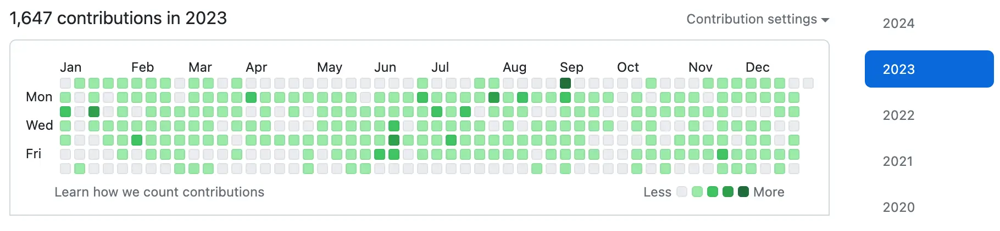
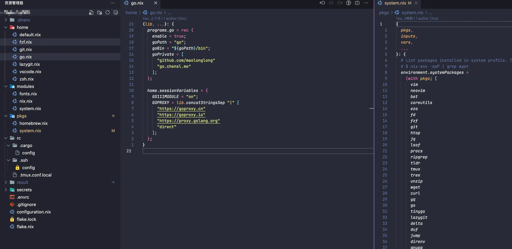

+++
title = '2023 年终总结'
pubDate = 2024-01-11T19:03:51+08:00
toc = true
draft = false
+++

迟到的 2023 年终总结。。。比起在公司写特别正式的总结，我更愿意写这种没任何要求，全看自己想法的总结。

## 技术相关

说来惭愧，折腾的技术比较杂，什么都玩了点，但都没有深入研究，缺乏系统的学习。

### GitHub

先看下 GitHub 的数据吧：



还算绿，但基本都是自己的玩具项目，社区的贡献只有 [nixpkgs](https://github.com/NixOS/nixpkgs)。

今年被 star 最多的项目居然是 [nvchad-go](https://github.com/maolonglong/nvchad-go)，非常意外，随手写的一个 neovim 配置，甚至我自己现在都不怎么用 neovim。

---

要说 2023 自己认为最有意义的项目，必须得是 OCaml 实现了一个 Scheme 的子集：

[](https://github.com/maolonglong/bogoscheme)

最重要的是，实现了宏！！！

最重要的是，实现了宏！！！

最重要的是，实现了宏！！！

拥有了直接操作**语法树**的黑魔法，比如我可以基于 `if` 创造一个 `and` **语法**:

```scheme
;; (and) -> #t
;; (and x) -> x
;; (and x y) -> (if x y #f)
;; (and x y z) -> (if x (and y z) #f)
(define-macro and
  (lambda (exp)
    (if (null? (cdr exp))
        #t
        (if (null? (cddr exp))
            (cadr exp)
            (list 'if (cadr exp) (cons 'and (cddr exp)) #f)))))
```

---

另外，今年还学了点 C 和 Zig，整了几个玩具项目：

[](https://github.com/maolonglong/zig-buddy2)
[](https://github.com/maolonglong/zig-mimalloc)
[](https://github.com/maolonglong/evio-lite.zig)
[](https://github.com/maolonglong/spsc_queue)
[](https://github.com/maolonglong/zsimd)

- **evio-lite.zig**: 和 Redis 作者学着写 [smallchat](https://github.com/antirez/smallchat)，顺手把 Go 版本的 [evio-lite](https://github.com/tidwall/evio-lite) 迁移到了 Zig
- **spsc_queue**: 当时面试[矩池云](https://matpool.com/)就栽在这了，那时候完全不理解 spsc, mpsc, mpmc 的区别，问我设计一个并发安全 ringbuffer 的思路，我直接往 lock 和 mpmc 的方向去想了

(Zig 给我的感觉就是写起来更 safe 的 C)

### Dotfiles

<https://codeberg.org/chensl/dotfiles>

以前看各种大神的 dotfiles 特别羡慕（一个 `install.sh` 搞定一台电脑的开发环境），但是真正到自己要上手写的时候，都被劝退了（各种不同的配置文件、软件依赖真的很难管理）。直到今年学习函数式编程，接触到了 [Nix](https://nixos.org/)，终于用一种简单（我能学会）的方式搞定了 dotfiles。

并且年底新买了一台 MacBook Air，大概花了半小时，就直接从 dotfiles 恢复了熟悉的开发环境。



安装大概就这样，在任何一台有 Nix 的 Mac 都能复现**一样**的环境：

```bash
nix --experimental-features 'nix-command flakes' run nix-darwin -- switch --flake .#chensl-mba
```

顺便能把各种乱七八糟的 XXX Version Manager (gvm, nvm, asdf-vm...) 都丢了，一个 Nix 搞定所有依赖管理的诉求。

## 学习的课程

该反思下，今年花在 学课程/看书 的时间太少了。。。本来工作后，个人时间就变少了，再加上在抖音和游戏上浪费点时间，留给学习（**学习**，指的不是折腾乱七八糟的技术）的就不多了。

- [CS3110：OCaml Programming Correct + Efficient + Beautiful](https://csdiy.wiki/%E7%BC%96%E7%A8%8B%E5%85%A5%E9%97%A8/CS3110/): 非常适合用来入门函数式编程
- [CMU CS15213: CSAPP](https://csdiy.wiki/%E4%BD%93%E7%B3%BB%E7%BB%93%E6%9E%84/CSAPP/): 很经典，刚开始看，用来补补计算机基础知识

## 工作

正经的工作总结在公司已经写了一遍了，就不再过多总结了，一个字「卷」。

### 一些感悟

- 作为一名工程师，关键不在于你会多牛的技术，而是你能用你的技术解决什么问题，这才是你的价值。
- 计划非常重要，什么事情紧急，什么事情重要。以及那些被暂时搁置的事项，有没有 deadline（而不是搁着搁着就没了）？

## 生活

身边比我早一年毕业的同学，都开始考虑买房了，而我还啥都不懂。。。

平常好像也很少想着带对象去哪里玩，除了过节回她家/回我家，也就上次去温州玩了一趟。（太宅了太社恐了，**得改**）

最后，晒一下我的猫：


