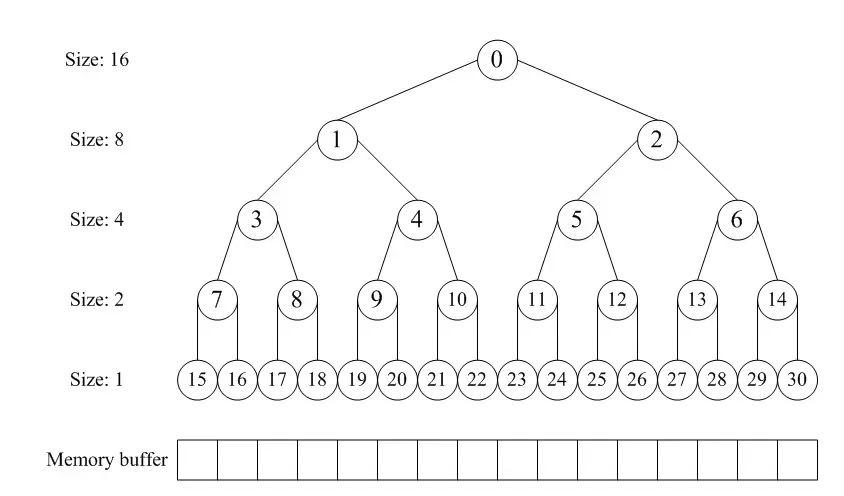

> 参考: <https://coolshell.org/articles/10427.html/>

这几天实现了一个简易 Buddy memory allocation，也算是打开了内存分配器的黑盒，了解了内存分配器的关键点和 **C 风格指针** 的强大（看着 unsafe 但是又还算 safe）。

该算法分配内存的大致流程：

alloc:

0. 首先，所有分配的内存块的大小都是 2 的幂（非 2 的幂会向上对齐）
1. 寻找大小合适的内存块，找到了直接返回
2. 如果没有找到，将内存块对半分（例如当前内存块大小为 128 但是只需要申请 32 的，就需要对半分两次）
3. 重复步骤 1

free:

1. 归还该内存块
2. 寻找相邻的内存块是否能合并
3. 如果合并了，重复步骤 2，继续寻找合并后的块，是否能继续和相邻的块合并

具体实现可以用一个数组形式的完全二叉树来监控内存块的使用情况。根节点代表整个内存块，往下一层代表对半分后更小的内存块：



更完整的内容可以看 [wuwenbin](https://github.com/wuwenbin/buddy2) 的实现或 [陈皓老师的 blog](https://coolshell.org/articles/10427.html/)，这里就不赘述，接下来主要讲一下我在 wuwenbin 那份实现上，新加的东西。

[](https://github.com/maolonglong/zig-buddy2)

<!-- more -->

## 移除了对 malloc 的依赖

总觉得，已经自己动手写分配器了，还需要依赖另一个分配器，有点怪怪的。

改写后，buddy 的底层内存由外部传入:

```zig
pub const Buddy2 = struct {
    const Self = @This();

    len: u8,
    _longest: [1]u8,

    pub fn init(ctx: []u8) *Self {
        const len = ctx.len / 2;
        assert(isPowerOfTwo(len));

        const self: *Self = @ptrCast(@alignCast(ctx));
        self.setLen(len);
        var node_size = len * 2;

        for (0..2 * len - 1) |i| {
            if (isPowerOfTwo(i + 1)) {
                node_size /= 2;
            }
            self.setLongest(i, node_size);
        }
        return self;
    }

    ...
}
```

## longest 数组类型改为 u8

原始代码中 longest 存储的是对应节点可分配的最大内存，需要用 usize (8 bytes，64 bit 机器的地址空间) 存储，由于所有块的大小都是 2 的幂，所以可以用 log2 之后的数值代表内存块大小，进而把存储空间缩为 u8 (1 bytes)。

**但是**，longest 的值为 0，是节点已被分配的标记，`log2(1)` 又等于 0，会造成冲突，我的解决方法是把 log2 的结果都加 1，把 0 让出来。

最后，再加上一些 branchless 的优化：

```zig
pub const Buddy2 = struct {
    ...

    fn longest(self: *const Self, index: usize) usize {
        const ptr: [*]const u8 = @ptrCast(&self._longest);
        const node_size = ptr[index];
        // if (node_size == 0) {
        //     return 0;
        // }
        // return @as(usize, 1) << @truncate(node_size - 1);
        return (@as(usize, 1) << @as(math.Log2Int(usize), @intCast(node_size))) >> 1;
    }

    fn setLongest(self: *Self, index: usize, node_size: usize) void {
        const ptr: [*]u8 = @ptrCast(&self._longest);
        // if (node_size == 0) {
        //     ptr[index] = 0;
        //     return;
        // }
        // ptr[index] = math.log2_int(usize, node_size) + 1;
        ptr[index] = math.log2_int(usize, (node_size << 1) | 1);
    }

    ...
}
```

## 适配 Zig 的 Allocator

> 刚好实践一下 vtable，以前只在 C++ 八股文里见到过。。。

在 Zig（或者传统的 C 中），多态需要用胖指针来实现。例如，如何把 `page_allocator`，`c_allocator`，`BuddyAllocator` 封装成一套统一的 `Allocator` 接口？

可以先看 Zig 中，Allocator VTable 的定义：

```zig
pub const VTable = struct {
    /// Attempt to allocate exactly `len` bytes aligned to `1 << ptr_align`.
    ///
    /// `ret_addr` is optionally provided as the first return address of the
    /// allocation call stack. If the value is `0` it means no return address
    /// has been provided.
    alloc: *const fn (ctx: *anyopaque, len: usize, ptr_align: u8, ret_addr: usize) ?[*]u8,

    /// Attempt to expand or shrink memory in place. `buf.len` must equal the
    /// length requested from the most recent successful call to `alloc` or
    /// `resize`. `buf_align` must equal the same value that was passed as the
    /// `ptr_align` parameter to the original `alloc` call.
    ///
    /// A result of `true` indicates the resize was successful and the
    /// allocation now has the same address but a size of `new_len`. `false`
    /// indicates the resize could not be completed without moving the
    /// allocation to a different address.
    ///
    /// `new_len` must be greater than zero.
    ///
    /// `ret_addr` is optionally provided as the first return address of the
    /// allocation call stack. If the value is `0` it means no return address
    /// has been provided.
    resize: *const fn (ctx: *anyopaque, buf: []u8, buf_align: u8, new_len: usize, ret_addr: usize) bool,

    /// Free and invalidate a buffer.
    ///
    /// `buf.len` must equal the most recent length returned by `alloc` or
    /// given to a successful `resize` call.
    ///
    /// `buf_align` must equal the same value that was passed as the
    /// `ptr_align` parameter to the original `alloc` call.
    ///
    /// `ret_addr` is optionally provided as the first return address of the
    /// allocation call stack. If the value is `0` it means no return address
    /// has been provided.
    free: *const fn (ctx: *anyopaque, buf: []u8, buf_align: u8, ret_addr: usize) void,
};
```

用这个 vtable 构造一个 Allocator:

```zig
pub const Buddy2Allocator = struct {
    const Self = @This();

    manager: *Buddy2,
    heap: []u8,

    pub fn init(heap: []u8) Self {
        var ctx_len = heap.len / 3 * 2;
        if (!isPowerOfTwo(ctx_len)) {
            ctx_len = fixLen(ctx_len) >> 1;
        }
        return Self{
            .manager = Buddy2.init(heap[0..ctx_len]),
            .heap = heap[ctx_len..],
        };
    }

    pub fn allocator(self: *Self) Allocator {
        return .{
            .ptr = self,
            .vtable = &.{
                .alloc = alloc,
                .resize = resize,
                .free = free,
            },
        };
    }

    ...
}
```

最后就是一套支持指定 alignment 的分配器实现：

buddy 有个很明显的优点，在分配 aligned pointer 时，不需要在指针里加 header。例如 `alignedAllocSize`，拿到指针本身，就可以算出对齐前的指针地址以及对应内存块的实际大小。

```zig
pub const Buddy2Allocator = struct {
    ...

    fn alloc(ctx: *anyopaque, len: usize, log2_ptr_align: u8, ret_addr: usize) ?[*]u8 {
        _ = ret_addr;
        const self: *Self = @ptrCast(@alignCast(ctx));
        return self.alignedAlloc(len, log2_ptr_align);
    }

    fn alignedAlloc(self: *Self, len: usize, log2_ptr_align: u8) ?[*]u8 {
        const alignment = @as(usize, 1) << @as(Allocator.Log2Align, @intCast(log2_ptr_align));

        var unaligned_ptr = @as([*]u8, @ptrCast(self.unalignedAlloc(len + alignment - 1) orelse return null));
        const unaligned_addr = @intFromPtr(unaligned_ptr);
        const aligned_addr = mem.alignForward(usize, unaligned_addr, alignment);

        return unaligned_ptr + (aligned_addr - unaligned_addr);
    }

    fn unalignedAlloc(self: *Self, len: usize) ?[*]u8 {
        const offset = self.manager.alloc(len) orelse return null;
        return @ptrFromInt(@intFromPtr(self.heap.ptr) + offset);
    }

    fn resize(ctx: *anyopaque, buf: []u8, log2_old_align: u8, new_len: usize, ret_addr: usize) bool {
        _ = log2_old_align;
        _ = ret_addr;
        const self: *Self = @ptrCast(@alignCast(ctx));
        return new_len <= self.alignedAllocSize(buf.ptr);
    }

    fn alignedAllocSize(self: *Self, ptr: [*]u8) usize {
        const aligned_offset = @intFromPtr(ptr) - @intFromPtr(self.heap.ptr);
        const index = self.manager.backward(aligned_offset);

        const unaligned_offset = self.manager.indexToOffset(index);
        const unaligned_size = self.manager.indexToSize(index);

        return unaligned_size - (aligned_offset - unaligned_offset);
    }

    fn free(ctx: *anyopaque, buf: []u8, log2_old_align: u8, ret_addr: usize) void {
        _ = log2_old_align;
        _ = ret_addr;
        const self: *Self = @ptrCast(@alignCast(ctx));
        self.alignedFree(buf.ptr);
    }

    fn alignedFree(self: *Self, ptr: [*]u8) void {
        self.manager.free(@intFromPtr(ptr) - @intFromPtr(self.heap.ptr));
    }
}
```


这个库有两个主要 API：

- Buddy2: 纯算法实现，不负责实际内存分配
- Buddy2Allocator: 基于 Buddy2 实现内存分配



## 优先分配小内存块

在寻找合适内存块的过程中，如果左右分支都满足要求，优先选择 `longest` 小的，尽量不去拆分大的内存块，减少内存碎片。

```zig
pub const Buddy2 = struct {
    ...

    pub fn alloc(self: *Self, len: usize) ?usize {
        ...

        while (node_size != new_len) : (node_size /= 2) {
            const left_longest = self.longest(left(index));
            const right_longest = self.longest(right(index));
            if (left_longest >= new_len and (right_longest < new_len or right_longest >= left_longest)) {
                index = left(index);
            } else {
                index = right(index);
            }
        }

        ...
    }

    ...
}
```

## 最后

重构/优化的过程中，一套完整的单元测试，真的能很大程度减小心智负担。


