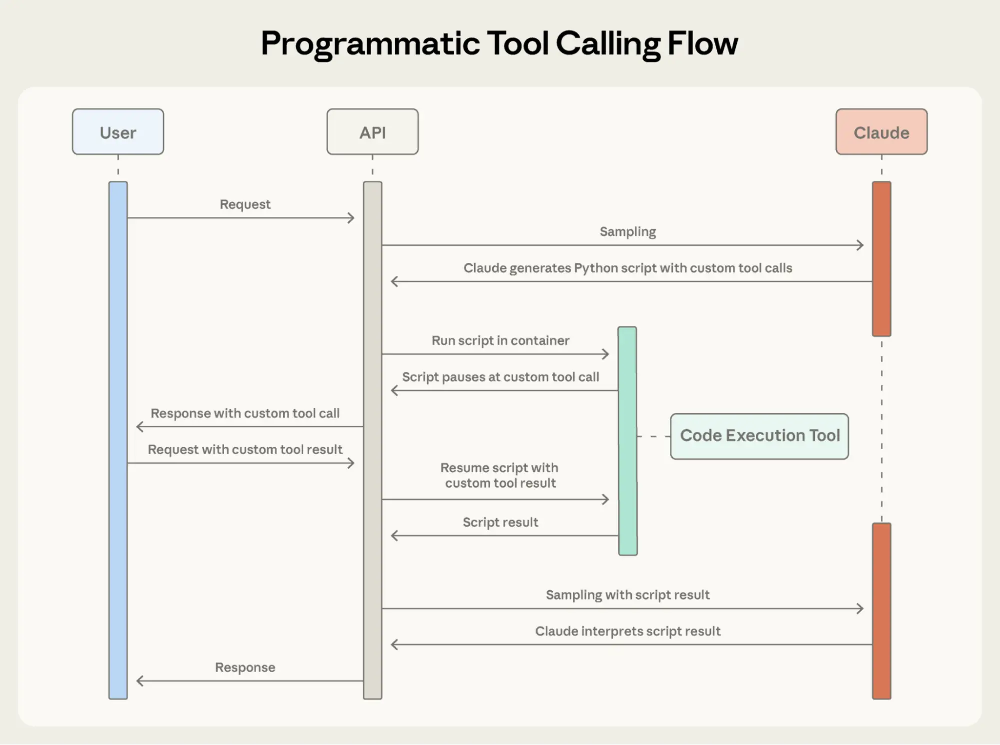

AI Agent（智能体）的未来在于模型能够无缝地协同数百甚至数千种工具工作：一个集成了 Git 操作、文件处理、包管理器、测试框架和部署流水线的 IDE 助手；或者一个能同时连接 Slack、GitHub、Google Drive、Jira、公司数据库以及数十个 MCP 服务器的运维协调员。

为了[构建高效的 Agent](https://www.anthropic.com/research/building-effective-agents)，它们需要能够使用无限的工具库，而不是预先将所有的工具定义都塞进上下文里。我们在关于[使用 MCP 进行代码执行](https://www.anthropic.com/engineering/code-execution-with-mcp)的博客文章中曾讨论过，工具的结果和定义有时会在 Agent 阅读请求之前就消耗掉 50,000 多个 Token。Agent 应该按需发现和加载工具，只保留与当前任务相关的内容。

Agent 还需要具备通过代码调用工具的能力。在使用自然语言调用工具时，每一次调用都需要经过完整的推理过程（Inference pass），而且无论中间结果是否有用，都会堆积在上下文中。代码是编排逻辑（如循环、条件判断和数据转换）的天然载体。Agent 需要能够根据手头的任务，灵活地在代码执行和模型推理之间做出选择。

此外，Agent 还需要从示例中学习正确的工具用法，而不仅仅依赖 Schema 定义。JSON Schema 定义了结构上的有效性，但无法表达使用模式：何时包含可选参数、哪些参数组合是合理的，或者 API 期望什么样的惯例。

今天，我们发布了三项功能来实现这一愿景：

- **工具搜索工具 (Tool Search Tool)**：允许 Claude 使用搜索工具访问成千上万个工具，而无需消耗其上下文窗口。
- **程序化工具调用 (Programmatic Tool Calling)**：允许 Claude 在代码执行环境中调用工具，从而减少对模型上下文窗口的影响。
- **工具使用示例 (Tool Use Examples)**：提供了一种通用标准，用于演示如何有效地使用给定工具。

在内部测试中，我们发现这些功能帮助我们构建出了利用传统工具使用模式无法实现的系统。例如，**[Claude for Excel](https://www.claude.com/claude-for-excel)** 使用程序化工具调用来读取和修改包含数千行数据的电子表格，而不会让模型的上下文窗口过载。

基于我们的经验，我们相信这些功能将为您利用 Claude 构建的应用开启全新的可能性。

<iframe width="560" height="315" src="https://www.youtube.com/embed/2MJDdzSXL74?si=GbCbYH0bkw_90Z33" title="YouTube video player" frameborder="0" allow="accelerometer; autoplay; clipboard-write; encrypted-media; gyroscope; picture-in-picture; web-share" referrerpolicy="strict-origin-when-cross-origin" allowfullscreen></iframe>

### 挑战

MCP 工具定义提供了重要的上下文，但随着连接的服务器增多，这些 Token 会迅速累积。设想一个包含五个服务器的配置：

- GitHub: 35 个工具 (~26K tokens)
- Slack: 11 个工具 (~21K tokens)
- Sentry: 5 个工具 (~3K tokens)
- Grafana: 5 个工具 (~3K tokens)
- Splunk: 2 个工具 (~2K tokens)

这意味着在对话开始之前，仅 58 个工具就消耗了大约 55K Token。如果再添加像 Jira 这样的服务器（仅它一个就使用约 17K Token），Token 开销很快就会超过 10 万。在 Anthropic，我们曾见过未优化的工具定义消耗了 134K Token。

但 Token 成本并不是唯一的问题。最常见的失败原因还包括错误的工具选择和错误的参数，尤其是当工具名称相似时，例如 `notification-send-user` 与 `notification-send-channel`。

### 我们的解决方案

**工具搜索工具 (Tool Search Tool)** 不再预先加载所有工具定义，而是按需发现工具。Claude 只会看到当前任务实际需要的工具。


与 Claude 的传统方法相比，工具搜索工具保留了 191,300 个 Token 的上下文空间，而传统方法仅剩 122,800 个。

传统方法：

- 预先加载所有工具定义（50+ MCP 工具约占 72K Token）
- 对话历史和系统提示词（System Prompt）争夺剩余空间
- 总上下文消耗：在任何工作开始前就已消耗约 77K Token

使用工具搜索工具：

- 仅预先加载工具搜索工具本身（约 500 Token）
- 根据需要按需发现工具（3-5 个相关工具，约 3K Token）
- 总上下文消耗：约 8.7K Token，保留了 95% 的上下文窗口

这意味着在保持对完整工具库访问权限的同时，Token 使用量减少了 85%。内部测试显示，在处理大型工具库时，MCP 评估的准确性有了显著提高。启用工具搜索工具后，Opus 4 的准确率从 49% 提升至 74%，Opus 4.5 从 79.5% 提升至 88.1%。

工具搜索工具让 Claude 能够动态发现工具，而不是预先加载所有定义。您向 API 提供所有工具定义，但将工具标记为 `defer_loading: true`（延迟加载），使其可按需发现。延迟加载的工具最初不会加载到 Claude 的上下文中。Claude 只会看到工具搜索工具本身以及任何标记为 `defer_loading: false` 的工具（即您最关键、最常用的工具）。

当 Claude 需要特定能力时，它会搜索相关工具。工具搜索工具返回匹配工具的引用，这些引用随后会在 Claude 的上下文中扩展为完整的定义。

例如，如果 Claude 需要与 GitHub 交互，它会搜索 "github"，然后只有 `github.createPullRequest` 和 `github.listIssues` 会被加载——而不是您来自 Slack、Jira 和 Google Drive 的其他 50 多个工具。

通过这种方式，Claude 可以访问您的完整工具库，但只需为它实际使用的工具支付 Token 成本。

**关于 Prompt 缓存的说明：** 工具搜索工具不会破坏 Prompt 缓存，因为延迟加载的工具完全被排除在初始 Prompt 之外。它们仅在 Claude 搜索后才被添加到上下文中，因此您的系统提示词和核心工具定义保持可缓存状态。

**实现方式：**

```json
{
  "tools": [
    // 包含一个工具搜索工具（regex, BM25 或自定义）
    {"type": "tool_search_tool_regex_20251119", "name": "tool_search_tool_regex"},

    // 标记工具以进行按需发现
    {
      "name": "github.createPullRequest",
      "description": "Create a pull request",
      "input_schema": {...},
      "defer_loading": true
    }
    // ... 数百个其他设置了 defer_loading: true 的延迟加载工具
  ]
}
```

对于 MCP 服务器，您可以延迟加载整个服务器，同时保持特定的高频工具处于加载状态：

```json
{
  "type": "mcp_toolset",
  "mcp_server_name": "google-drive",
  "default_config": { "defer_loading": true }, // 延迟加载整个服务器
  "configs": {
    "search_files": {
      "defer_loading": false
    } // 保持最常用的工具处于加载状态
  }
}
```

Claude 开发者平台开箱即用地提供了基于正则表达式和 BM25 的搜索工具，但您也可以使用 Embeddings（嵌入）或其他策略实现自定义搜索工具。

像任何架构决策一样，启用工具搜索工具也涉及权衡。该功能在工具调用前增加了一个搜索步骤，因此只有当节省的上下文和提高的准确性超过额外的延迟时，它才能提供最佳的投资回报率 (ROI)。

**适用场景：**

- 工具定义消耗超过 10K Token
- 遇到工具选择准确性问题
- 构建具有多个服务器的 MCP 驱动系统
- 可用工具数量超过 10 个

**不太适用的场景：**

- 工具库较小（<10 个工具）
- 所有工具在每次会话中都频繁使用
- 工具定义非常紧凑

## 程序化工具调用 (Programmatic Tool Calling)

### 挑战

随着工作流变得越来越复杂，传统的工具调用会产生两个根本性问题：

- **中间结果造成的上下文污染**：当 Claude 分析一个 10MB 的日志文件以查找错误模式时，整个文件都会进入其上下文窗口，即使 Claude 只需要错误频率的摘要。当跨多个表获取客户数据时，每条记录都会累积在上下文中，无论其相关性如何。这些中间结果消耗了大量的 Token 预算，甚至可能将重要信息完全挤出上下文窗口。
- **推理开销和人工合成**：每次工具调用都需要一次完整的模型推理过程。收到结果后，Claude 必须“肉眼观察”数据以提取相关信息，推理由各个部分如何组合在一起，并决定下一步做什么——所有这些都是通过自然语言处理完成的。一个包含五个工具的工作流意味着五次推理过程，加上 Claude 解析每个结果、比较数值并综合得出结论。这既缓慢又容易出错。

### 我们的解决方案

**程序化工具调用**使 Claude 能够通过代码而不是通过单独的 API 往返来编排工具。Claude 不是一次请求一个工具并将每个结果返回到其上下文，而是编写代码来调用多个工具，处理它们的输出，并控制实际进入其上下文窗口的信息。

Claude 擅长编写代码，通过让它用 Python 表达编排逻辑，而不是通过自然语言调用工具，您可以获得更可靠、更精确的控制流。循环、条件判断、数据转换和错误处理都在代码中显式表达，而不是隐含在 Claude 的推理中。

#### 示例：预算合规性检查

考虑一个常见的业务任务：“哪些团队成员超出了他们的 Q3 差旅预算？”

您有三个可用工具：

- `get_team_members(department)` - 返回包含 ID 和级别的团队成员列表
- `get_expenses(user_id, quarter)` - 返回用户的费用明细项
- `get_budget_by_level(level)` - 返回员工级别的预算限额

**传统方法**：

- 获取团队成员 → 20 人
- 为每个人获取 Q3 费用 → 20 次工具调用，每次返回 50-100 个明细项（机票、酒店、餐饮、收据）
- 按员工级别获取预算限额
- 所有这些都进入 Claude 的上下文：2,000+ 费用明细项 (50 KB+)
- Claude 手动汇总每个人的费用，查找他们的预算，将费用与预算限额进行比较
- 更多的模型往返交互，巨大的上下文消耗

**使用程序化工具调用**：

Claude 不是将每个工具结果返回给模型，而是编写一个 Python 脚本来编排整个工作流。该脚本在代码执行工具（一个沙箱环境）中运行，并在需要您的工具结果时暂停。当您通过 API 返回工具结果时，它们由脚本处理，而不是由模型消耗。脚本继续执行，Claude 只看到最终输出。



程序化工具调用使 Claude 能够通过代码而不是单独的 API 往返来编排工具，从而允许并行执行工具。

以下是 Claude 针对预算合规性任务的编排代码示例：

```python
team = await get_team_members("engineering")

# 为每个唯一级别获取预算
levels = list(set(m["level"] for m in team))
budget_results = await asyncio.gather(*[
    get_budget_by_level(level) for level in levels
])

# 创建查找字典: {"junior": budget1, "senior": budget2, ...}
budgets = {level: budget for level, budget in zip(levels, budget_results)}

# 并行获取所有费用
expenses = await asyncio.gather(*[
    get_expenses(m["id"], "Q3") for m in team
])

# 查找超出差旅预算的员工
exceeded = []
for member, exp in zip(team, expenses):
    budget = budgets[member["level"]]
    total = sum(e["amount"] for e in exp)
    if total > budget["travel_limit"]:
        exceeded.append({
            "name": member["name"],
            "spent": total,
            "limit": budget["travel_limit"]
        })

print(json.dumps(exceeded))
```

Claude 的上下文仅接收最终结果：那两三个超出预算的人。2,000 多个明细项、中间总和和预算查找不会影响 Claude 的上下文，将消耗从 200KB 的原始费用数据减少到仅 1KB 的结果。

效率提升是巨大的：

- **节省 Token**：通过将中间结果保留在 Claude 的上下文之外，PTC（程序化工具调用）显著减少了 Token 消耗。在复杂的研究任务中，平均使用量从 43,588 Token 降至 27,297 Token，减少了 37%。
- **降低延迟**：每次 API 往返都需要模型推理（数百毫秒到数秒）。当 Claude 在单个代码块中编排 20 多个工具调用时，您消除了 19 次以上的推理过程。API 处理工具执行，而无需每次都返回模型。
- **提高准确性**：通过编写显式的编排逻辑，Claude 比在自然语言中处理多个工具结果时犯的错误更少。内部知识检索准确率从 25.6% 提高到 28.5%；[GIA 基准测试](https://arxiv.org/abs/2311.12983)从 46.5% 提高到 51.2%。

生产环境的工作流涉及杂乱的数据、条件逻辑和需要扩展的操作。程序化工具调用让 Claude 以编程方式处理这种复杂性，同时将其注意力集中在可操作的结果上，而不是原始数据处理上。

### 程序化工具调用的工作原理

#### 1. 将工具标记为可从代码调用

向工具添加 `code_execution`，并设置 `allowed_callers` 以选择加入程序化执行的工具：

```json
{
  "tools": [
    {
      "type": "code_execution_20250825",
      "name": "code_execution"
    },
    {
      "name": "get_team_members",
      "description": "Get all members of a department...",
      "input_schema": {...},
      "allowed_callers": ["code_execution_20250825"] // 选择加入程序化工具调用
    },
    {
      "name": "get_expenses",
     ...
    },
    {
      "name": "get_budget_by_level",
    ...
    }
  ]
}
```

API 将这些工具定义转换为 Claude 可以调用的 Python 函数。

#### 2. Claude 编写编排代码

Claude 不是一次请求一个工具，而是生成 Python 代码：

```json
{
  "type": "server_tool_use",
  "id": "srvtoolu_abc",
  "name": "code_execution",
  "input": {
    "code": "team = get_team_members('engineering')\n..." // 上面的代码示例
  }
}
```

#### 3. 工具执行而不占用 Claude 的上下文

当代码调用 `get_expenses()` 时，您会收到一个带有 `caller` 字段的工具请求：

```json
{
  "type": "tool_use",
  "id": "toolu_xyz",
  "name": "get_expenses",
  "input": { "user_id": "emp_123", "quarter": "Q3" },
  "caller": {
    "type": "code_execution_20250825",
    "tool_id": "srvtoolu_abc"
  }
}
```

您提供结果，该结果在代码执行环境中处理，而不是在 Claude 的上下文中。这个请求-响应循环对代码中的每个工具调用重复进行。

#### 4. 只有最终输出进入上下文

当代码运行结束时，只有代码的结果会返回给 Claude：

```json
{
  "type": "code_execution_tool_result",
  "tool_use_id": "srvtoolu_abc",
  "content": {
    "stdout": "[{\"name\": \"Alice\", \"spent\": 12500, \"limit\": 10000}...]"
  }
}
```

这就是 Claude 看到的全部内容，而不是沿途处理的 2000 多个费用明细项。

### 何时使用程序化工具调用

程序化工具调用在您的工作流中增加了一个代码执行步骤。当 Token 节省、延迟改善和准确性提高显著时，这种额外的开销是值得的。

**最有利的场景：**

- 处理只需要聚合或摘要的大型数据集
- 运行具有三个或更多依赖工具调用的多步工作流
- 在 Claude 看到结果之前过滤、排序或转换工具结果
- 处理中间数据不应影响 Claude 推理的任务
- 对许多项目运行并行操作（例如，检查 50 个端点）

**不太有利的场景：**

- 进行简单的单工具调用
- 处理 Claude 应该看到并推理所有中间结果的任务
- 运行响应较小的快速查找

## 工具使用示例 (Tool Use Examples)

### 挑战

JSON Schema 擅长定义结构——类型、必填字段、允许的枚举——但它无法表达使用模式：何时包含可选参数、哪些组合是合理的，或者您的 API 期望什么样的惯例。

考虑一个支持工单 API：

```json
{
  "name": "create_ticket",
  "input_schema": {
    "properties": {
      "title": { "type": "string" },
      "priority": { "enum": ["low", "medium", "high", "critical"] },
      "labels": { "type": "array", "items": { "type": "string" } },
      "reporter": {
        "type": "object",
        "properties": {
          "id": { "type": "string" },
          "name": { "type": "string" },
          "contact": {
            "type": "object",
            "properties": {
              "email": { "type": "string" },
              "phone": { "type": "string" }
            }
          }
        }
      },
      "due_date": { "type": "string" },
      "escalation": {
        "type": "object",
        "properties": {
          "level": { "type": "integer" },
          "notify_manager": { "type": "boolean" },
          "sla_hours": { "type": "integer" }
        }
      }
    },
    "required": ["title"]
  }
}
```

Schema 定义了什么是有效的，但留下了关键问题未解答：

- **格式歧义**：`due_date` 应该使用 "2024-11-06"、"Nov 6, 2024" 还是 "2024-11-06T00:00:00Z"？
- **ID 惯例**：`reporter.id` 是 UUID、"USR-12345" 还是仅仅是 "12345"？
- **嵌套结构用法**：Claude 何时应该填充 `reporter.contact`？
- **参数关联**：`escalation.level` 和 `escalation.sla_hours` 如何与优先级相关联？

这些歧义可能导致格式错误的工具调用和不一致的参数使用。

### 我们的解决方案

**工具使用示例**允许您直接在工具定义中提供示例工具调用。您不再仅依赖 Schema，而是向 Claude 展示具体的使用模式：

通过这三个示例，Claude 学习到：

- **格式惯例**：日期使用 YYYY-MM-DD，用户 ID 遵循 USR-XXXXX，标签使用 kebab-case（短横线命名）
- **嵌套结构模式**：如何构建包含嵌套联系人对象的报告者对象
- **可选参数关联**：严重 Bug 需要完整的联系信息 + 具有严格 SLA 的升级策略；功能请求有报告者但没有联系人/升级策略；内部任务只有标题

在我们自己的内部测试中，工具使用示例将复杂参数处理的准确率从 72% 提高到了 90%。

### 何时使用工具使用示例

工具使用示例会增加工具定义的 Token，因此当准确性的提高超过额外成本时，它们最有价值。

**最有利的场景：**

- 复杂的嵌套结构，其中有效的 JSON 并不意味着正确的使用
- 具有许多可选参数且包含模式很重要的工具
- 具有 Schema 未捕获的特定领域惯例的 API
- 相似的工具，示例可以阐明应该使用哪一个（例如，`create_ticket` vs `create_incident`）

**不太有利的场景：**

- 具有明显用法的简单单参数工具
- Claude 已经理解的标准格式，如 URL 或电子邮件
- 最好由 JSON Schema 约束处理的验证问题

## 最佳实践

构建能够采取现实世界行动的 Agent 意味着同时处理规模、复杂性和精度。这三个功能协同工作，解决了工具使用工作流中的不同瓶颈。以下是如何有效地组合它们。

### 策略性地分层功能

并非每个 Agent 都需要在给定任务中使用所有这三个功能。从您最大的瓶颈开始：

- 工具定义导致的上下文膨胀 → **工具搜索工具**
- 大型中间结果污染上下文 → **程序化工具调用**
- 参数错误和格式错误的调用 → **工具使用示例**

这种有针对性的方法让您可以解决限制 Agent 性能的具体约束，而不是预先增加复杂性。

然后根据需要分层添加其他功能。它们是互补的：工具搜索工具确保找到正确的工具，程序化工具调用确保高效执行，工具使用示例确保正确调用。

工具搜索会匹配名称和描述，因此清晰、描述性的定义可以提高发现的准确性。

```json
// Good
{
    "name": "search_customer_orders",
    "description": "Search for customer orders by date range, status, or total amount. Returns order details including items, shipping, and payment info."
}

// Bad
{
    "name": "query_db_orders",
    "description": "Execute order query"
}
```

添加系统提示词指导，以便 Claude 知道有哪些可用功能：

```text
You have access to tools for Slack messaging, Google Drive file management,
Jira ticket tracking, and GitHub repository operations. Use the tool search
to find specific capabilities.
```

保持三到五个最常用的工具始终加载，其余的延迟加载。这平衡了常用操作的即时访问与其他操作的按需发现。

### 设置程序化工具调用以确保正确执行

由于 Claude 编写代码来解析工具输出，请清晰地记录返回格式。这有助于 Claude 编写正确的解析逻辑：

```json
{
    "name": "get_orders",
    "description": "Retrieve orders for a customer.
Returns:
    List of order objects, each containing:
    - id (str): Order identifier
    - total (float): Order total in USD
    - status (str): One of 'pending', 'shipped', 'delivered'
    - items (list): Array of {sku, quantity, price}
    - created_at (str): ISO 8601 timestamp"
}
```

以下是受益于程序化编排的工具类型（选择加入）：

- 可以并行运行的工具（独立操作）
- 可以安全重试的操作（幂等）

### 设置工具使用示例以确保参数准确性

精心制作示例以明确行为：

- 使用真实数据（真实的城市名称、合理的价格，而不是 "string" 或 "value"）
- 展示多样性，包括最小化、部分和完整的规范模式
- 保持简洁：每个工具 1-5 个示例
- 关注歧义（仅添加那些无法从 Schema 中明显看出正确用法的示例）

## 开始使用

这些功能目前处于测试阶段 (Beta)。要启用它们，请添加 Beta 标头并包含您需要的工具：

```python
client.beta.messages.create(
    betas=["advanced-tool-use-2025-11-20"],
    model="claude-sonnet-4-5-20250929",
    max_tokens=4096,
    tools=[
        {"type": "tool_search_tool_regex_20251119", "name": "tool_search_tool_regex"},
        {"type": "code_execution_20250825", "name": "code_execution"},
        # 您的带有 defer_loading, allowed_callers 和 input_examples 的工具
    ]
)
```

有关详细的 API 文档和 SDK 示例，请参阅我们的：

- 工具搜索工具的 [文档](https://platform.claude.com/docs/en/agents-and-tools/tool-use/tool-search-tool) 和 [Cookbook](https://github.com/anthropics/claude-cookbooks/blob/main/tool_use/tool_search_with_embeddings.ipynb)
- 程序化工具调用的 [文档](https://platform.claude.com/docs/en/agents-and-tools/tool-use/programmatic-tool-calling) 和 [Cookbook](https://github.com/anthropics/claude-cookbooks/blob/main/tool_use/programmatic_tool_calling_ptc.ipynb)
- 工具使用示例的 [文档](https://platform.claude.com/docs/en/agents-and-tools/tool-use/implement-tool-use#providing-tool-use-examples)

这些功能将工具使用从简单的函数调用推向了智能编排。随着 Agent 处理涉及数十种工具和大型数据集的更复杂工作流，动态发现、高效执行和可靠调用将成为基础。

我们期待看到您构建的产品。

## 致谢

本文由 Bin Wu 撰写，Adam Jones, Artur Renault, Henry Tay, Jake Noble, Nathan McCandlish, Noah Picard, Sam Jiang 以及 Claude 开发者平台团队做出了贡献。这项工作建立在 Chris Gorgolewski, Daniel Jiang, Jeremy Fox 和 Mike Lambert 的基础研究之上。我们也从整个 AI 生态系统中汲取了灵感，包括 [Joel Pobar 的 LLMVM](https://github.com/9600dev/llmvm)、[Cloudflare 的 Code Mode](https://blog.cloudflare.com/code-mode/) 以及 [Code Execution as MCP](https://www.anthropic.com/engineering/code-execution-with-mcp)。特别感谢 Andy Schumeister, Hamish Kerr, Keir Bradwell, Matt Bleifer 和 Molly Vorwerck 的支持。
