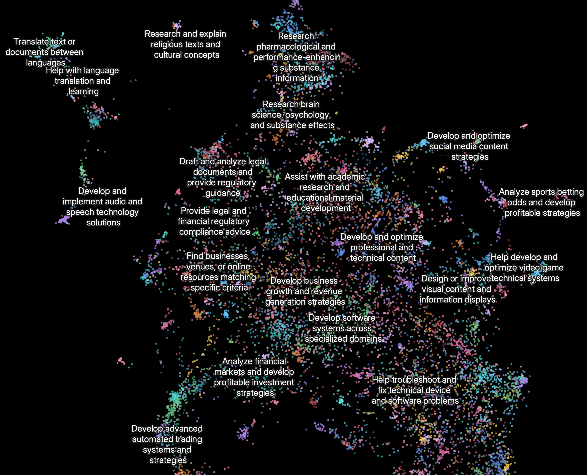

Claude 现已具备 [研究能力 (Research capabilities)](https://www.anthropic.com/news/research)，能够在网络、Google Workspace 以及任何集成应用中进行搜索，以完成复杂的任务。

这个多智能体 (multi-agent) 系统从原型到生产环境的旅程，教会了我们关于系统架构、工具设计和提示工程 (prompt engineering) 的关键一课。多智能体系统由多个协同工作的智能体组成（即在循环中自主使用工具的 LLM）。我们的 Research 功能包含一个主智能体，它根据用户查询规划研究过程，然后使用工具创建并行智能体来同时搜索信息。多智能体系统的引入带来了智能体协调、评估和可靠性方面的全新挑战。

这篇文章详细拆解了在这个过程中行之有效的原则——无论是对我们，还是对正在构建多智能体系统的你，希望这些经验都能有所裨益。

### 多智能体系统的优势

研究工作涉及的是开放式问题，很难预先预测所需的步骤。你无法为探索复杂主题硬编码一条固定路径，因为这个过程本质上是动态且具有路径依赖性的 (path-dependent)。当人类进行研究时，他们倾向于根据新发现不断更新方法，追踪调查过程中出现的线索。

这种不可预测性使得 AI 智能体特别适合研究任务。研究需要在调查展开时灵活调整方向或探索切线联系。模型必须自主进行多轮操作，根据中间发现决定下一步的追踪方向。线性的、单次执行 (one-shot) 的流水线无法处理此类任务。

搜索的本质是压缩：从海量语料库中提炼洞见。子智能体 (Subagents) 通过各自独立的上下文窗口 (context windows) 并行运作，有助于促进这种压缩。它们在将最重要的 Token 浓缩给主研究智能体之前，会同时探索问题的不同方面。每个子智能体还实现了关注点分离 (separation of concerns)——使用独特的工具、提示词和探索轨迹——这减少了路径依赖，并实现了彻底、独立的调查。

一旦智力达到某个阈值，多智能体系统就成为扩展性能的关键途径。例如，尽管人类个体的智力在过去 10 万年中有所提升，但人类社会之所以在信息时代变得能力*指数级*更强，是因为我们的*集体*智慧和协调能力。即便是具有通用智能的个体，单打独斗时也会面临局限；而智能体群体则能成就更多。

我们的内部评估表明，多智能体研究系统特别擅长处理涉及同时追踪多个独立方向的广度优先 (breadth-first) 查询。我们发现，以 Claude Opus 4 为主智能体、Claude Sonnet 4 为子智能体的多智能体系统，在我们的内部研究评估中，其表现比单智能体 Claude Opus 4 高出 90.2%。例如，当被要求找出标准普尔 500 指数中所有信息技术类公司的董事会成员时，多智能体系统通过将任务分解给子智能体找到了正确答案，而单智能体系统则因缓慢的顺序搜索而未能找到答案。

多智能体系统之所以有效，主要是因为它们能通过消耗足够的 Token 来解决问题。在我们的分析中，三个因素解释了 [BrowseComp](https://openai.com/index/browsecomp/) 评估（测试浏览型智能体定位难寻信息的能力）中 95% 的性能差异。我们发现 Token 使用量本身就解释了 80% 的差异，另外两个解释因素是工具调用次数和模型选择。这一发现验证了我们的架构：通过将工作分配给具有独立上下文窗口的智能体，增加了并行推理的能力。最新的 Claude 模型是 Token 使用效率的巨大倍增器，因为升级到 Claude Sonnet 4 带来的性能提升，要大于在 Claude Sonnet 3.7 上增加一倍 Token 预算带来的提升。多智能体架构有效地扩展了 Token 使用量，以应对超出单智能体极限的任务。

当然也有缺点：在实践中，这些架构消耗 Token 的速度极快。在我们的数据中，智能体通常消耗的 Token 是聊天交互的 4 倍左右，而多智能体系统的消耗量则是聊天的 15 倍左右。为了经济上的可行性，多智能体系统需要应用于那些价值足以覆盖性能提升成本的任务。此外，某些需要所有智能体共享同一上下文或涉及智能体之间大量依赖关系的领域，目前并不适合多智能体系统。例如，大多数编码任务涉及的真正可并行化任务比研究任务少，而且 LLM 智能体目前在实时协调和委托给其他智能体方面还不够出色。我们发现，多智能体系统在那些涉及大量并行化、超出单一上下文窗口的信息量以及需要与众多复杂工具交互的高价值任务中表现卓越。

### Research 的架构概览

我们的 Research 系统采用了带有 Orchestrator-Worker（编排者-工作者）模式的多智能体架构，其中主智能体协调整个过程，同时委托给专门的子智能体并行操作。

运行中的多智能体架构：用户查询流经主智能体，主智能体创建专门的子智能体来并行搜索不同方面。

当用户提交查询时，主智能体对其进行分析，制定策略，并生成子智能体以同时探索不同方面。如上图所示，子智能体充当智能过滤器，通过迭代使用搜索工具来收集信息（本例中是关于 2025 年的 AI 智能体公司），然后将公司列表返回给主智能体，以便其汇总最终答案。

传统的检索增强生成 (RAG) 方法使用的是静态检索。也就是说，它们提取一组与输入查询最相似的切片 (chunks)，并使用这些切片生成响应。相比之下，我们的架构使用多步搜索，动态查找相关信息，适应新发现，并分析结果以制定高质量的答案。

展示我们多智能体 Research 系统完整工作流的流程图。当用户提交查询时，系统会创建一个 LeadResearcher（首席研究员）智能体，进入迭代研究过程。LeadResearcher 首先思考方法并将计划保存到 Memory（内存）中以持久化上下文，因为如果上下文窗口超过 200,000 个 Token，它将被截断，而保留计划至关重要。然后它创建专门的 Subagents（子智能体，此处显示了两个，但可以是任意数量）来执行具体的研究任务。每个 Subagent 独立执行网络搜索，使用交错思维 (interleaved thinking) 评估工具结果，并将发现返回给 LeadResearcher。LeadResearcher 综合这些结果并决定是否需要更多研究——如果需要，它可以创建额外的子智能体或改进策略。一旦收集到足够的信息，系统就会退出研究循环，将所有发现传递给 CitationAgent（引用智能体），后者处理文档和研究报告以确定引用的具体位置。这确保了所有主张都正确归因于其来源。最终的研究结果（包含引用）随后被返回给用户。

### 研究智能体的提示工程与评估

多智能体系统与单智能体系统有着关键区别，包括协调复杂度的快速增长。早期的智能体经常犯错，比如为简单的查询生成 50 个子智能体，无休止地在网络上搜索不存在的来源，或者因过多的更新而相互干扰。由于每个智能体都由提示词 (prompt) 驱动，提示工程是我们改善这些行为的主要杠杆。以下是我们学到的关于提示智能体的一些原则：

1. **像你的智能体一样思考。** 要迭代提示词，你必须了解它们的效果。为了帮助我们做到这一点，我们使用我们的 [Console](https://console.anthropic.com/) 构建了模拟环境，使用系统中的确切提示词和工具，然后观察智能体的一步步工作。这立即揭示了故障模式：智能体在已有足够结果时仍继续工作，使用过于冗长的搜索查询，或选择错误的工具。有效的提示依赖于建立对智能体的准确心智模型 (mental model)，这能让最具影响力的修改变得显而易见。
2. **教会编排者如何授权。** 在我们的系统中，主智能体将查询分解为子任务并将其描述给子智能体。每个子智能体都需要一个目标、一种输出格式、关于使用哪些工具和来源的指导，以及清晰的任务边界。如果没有详细的任务描述，智能体就会重复工作、遗漏内容或无法找到必要信息。我们起初允许主智能体给出简单、简短的指令，如“研究半导体短缺”，但发现这些指令往往过于模糊，导致子智能体误解任务或执行与其他智能体完全相同的搜索。例如，一个子智能体探索了 2021 年的汽车芯片危机，而另外 2 个子智能体则在重复调查当前 2025 年的供应链，缺乏有效的分工。
3. **根据查询复杂度调整投入。** 智能体很难判断不同任务所需的适当工作量，因此我们在提示词中嵌入了规模缩放规则。简单的事实核查只需 1 个智能体进行 3-10 次工具调用；直接比较可能需要 2-4 个子智能体，每个进行 10-15 次调用；而复杂的研究可能会使用超过 10 个子智能体，且职责分工明确。这些明确的指导方针有助于主智能体有效分配资源，防止在简单查询上过度投入，这是我们早期版本中常见的故障模式。
4. **工具设计和选择至关重要。** 智能体与工具的接口 (Agent-tool interfaces) 与人机接口一样重要。使用正确的工具是高效的——通常，这是绝对必要的。例如，一个在网络上搜索仅存在于 Slack 中的上下文的智能体注定会失败。随着 [MCP 服务器](https://modelcontextprotocol.io/introduction) 为模型提供访问外部工具的能力，这个问题变得更加复杂，因为智能体遇到的未知工具及其描述质量参差不齐。我们给了智能体明确的启发式策略 (heuristics)：例如，首先检查所有可用工具，将工具使用与用户意图匹配，进行广泛的外部探索时搜索网络，或者优先选择专用工具而非通用工具。糟糕的工具描述会将智能体引向完全错误的路径，因此每个工具都需要一个独特的目的和清晰的描述。
5. **让智能体自我改进。** 我们发现 Claude 4 模型可以是出色的提示工程师。当给定一个提示词和一个故障模式时，它们能够诊断智能体失败的原因并建议改进。我们甚至创建了一个工具测试智能体——当给定一个有缺陷的 MCP 工具时，它会尝试使用该工具，然后重写工具描述以避免故障。通过数十次测试该工具，这个智能体发现了关键的细微差别和 Bug。这种改善工具人体工程学 (ergonomics) 的过程使后续使用新描述的智能体的任务完成时间减少了 40%，因为它们能够避免大多数错误。
6. **先宽泛，再收窄。** 搜索策略应反映专家级的人类研究：在深入细节之前先探索全貌。智能体通常默认使用过于冗长、具体的查询，结果寥寥无几。我们通过提示智能体从简短、宽泛的查询开始，评估可用信息，然后逐步缩小焦点来抵消这种倾向。
7. **引导思考过程。** [扩展思维模式 (Extended thinking mode)](https://docs.anthropic.com/en/docs/build-with-claude/extended-thinking) 引导 Claude 在可见的思考过程中输出额外的 Token，这可以作为一个可控的草稿本。主智能体利用思考来规划其方法，评估哪些工具适合任务，确定查询复杂度和子智能体数量，并定义每个子智能体的角色。我们的测试表明，扩展思维提高了指令遵循能力、推理能力和效率。子智能体也会进行规划，然后在获得工具结果后使用 [交错思维 (interleaved thinking)](https://docs.anthropic.com/en/docs/build-with-claude/extended-thinking#interleaved-thinking) 来评估质量、识别缺口并优化下一个查询。这使得子智能体在适应任何任务时都更加有效。
8. **并行工具调用改变速度和性能。** 复杂的研究任务自然涉及探索许多来源。我们早期的智能体执行顺序搜索，速度极其缓慢。为了提高速度，我们引入了两种并行化：(1) 主智能体并行启动 3-5 个子智能体，而不是串行启动；(2) 子智能体并行使用 3 个以上的工具。这些改变将复杂查询的研究时间缩短了高达 90%，使 Research 能够在几分钟而不是几小时内完成更多工作，同时覆盖比其他系统更多的信息。

我们的提示策略侧重于灌输良好的启发式策略，而不是僵化的规则。我们研究了熟练的人类如何处理研究任务，并将这些策略编码到我们的提示词中——诸如将难题分解为较小的任务、仔细评估来源质量、根据新信息调整搜索方法，以及识别何时注重深度（详细调查一个主题）与广度（并行探索许多主题）。我们还通过设置明确的护栏 (guardrails) 来主动缓解意外的副作用，防止智能体失控。最后，我们专注于通过可观测性和测试用例实现快速迭代循环。

### 智能体的有效评估

良好的评估 (evaluations) 对于构建可靠的 AI 应用程序至关重要，智能体也不例外。然而，评估多智能体系统面临着独特的挑战。传统的评估通常假设 AI 每次都遵循相同的步骤：给定输入 X，系统应遵循路径 Y 产生输出 Z。但多智能体系统并非如此运作。即使起点相同，智能体也可能采取完全不同但有效的路径来实现目标。一个智能体可能搜索三个来源，而另一个搜索十个，或者它们可能使用不同的工具找到相同的答案。因为我们并不总是知道正确的步骤是什么，所以通常不能仅仅检查智能体是否遵循了我们预设的“正确”步骤。相反，我们需要灵活的评估方法，判断智能体是否达到了正确的结果，同时也遵循了合理的过程。

**立即开始小样本评估。** 在智能体开发的早期，改变往往会产生巨大的影响，因为有大量容易摘到的果实 (low-hanging fruit)。微调提示词可能会将成功率从 30% 提高到 80%。由于效应量如此之大，你只需几个测试用例就能发现变化。我们从一组约 20 个代表真实使用模式的查询开始。测试这些查询通常能让我们清楚地看到变化的影响。我们经常听到 AI 开发团队推迟创建评估，因为他们认为只有包含数百个测试用例的大型评估才有用。然而，最好是用几个例子立即开始小规模测试，而不是拖到能建立更彻底的评估时才动手。

**LLM-as-judge（LLM作为评判者）评估在得当实施时具有可扩展性。** 研究输出很难通过编程方式评估，因为它们是自由格式的文本，很少有唯一的正确答案。LLM 天然适合为输出评分。我们使用了一个 LLM 评判者，根据量表中的标准评估每个输出：事实准确性（主张是否与来源匹配？）、引用准确性（引用的来源是否与主张匹配？）、完整性（是否涵盖了所有要求的方面？）、来源质量（是否使用了原始来源而非低质量的二手来源？）以及工具效率（是否以合理的次数使用了正确的工具？）。我们尝试过使用多个评判者来评估每个组件，但发现使用单个提示词输出 0.0-1.0 的分数及通过/失败等级的单个 LLM 调用是最一致的，且与人类判断最吻合。当评估测试用例*确实*有一个明确的答案时，这种方法特别有效，我们可以使用 LLM 评判者简单地检查答案是否正确（即它是否准确列出了研发预算最大的前 3 家制药公司？）。使用 LLM 作为评判者使我们能够可扩展地评估数百个输出。

**人类评估能捕捉自动化遗漏的问题。** 测试智能体的人类能发现评估遗漏的边缘情况。这些包括对不寻常查询的幻觉答案、系统故障或微妙的来源选择偏差。在我们的案例中，人类测试员注意到我们早期的智能体始终选择 SEO 优化的内容农场，而不是像学术 PDF 或个人博客那样权威但排名较低的来源。在我们的提示词中添加来源质量启发式策略有助于解决这个问题。即便在自动化评估的世界里，人工测试仍然必不可少。

多智能体系统具有涌现行为 (emergent behaviors)，这些行为是在没有特定编程的情况下产生的。例如，对主智能体的微小更改可能会不可预测地改变子智能体的行为方式。成功需要理解交互模式，而不仅仅是单个智能体的行为。因此，针对这些智能体的最佳提示词不仅仅是严格的指令，更是定义分工、解决问题的方法和工作量预算的协作框架。做好这一点依赖于细致的提示词和工具设计、扎实的启发式策略、可观测性以及紧密的反馈循环。请参阅我们 [Cookbook 中的开源提示词](https://github.com/anthropics/anthropic-cookbook/tree/main/patterns/agents/prompts) 获取我们系统的示例提示词。

### 生产可靠性与工程挑战

在传统软件中，Bug 可能会破坏功能、降低性能或导致中断。在智能体系统 (agentic systems) 中，微小的变化会级联成巨大的行为变化，这使得为需要在长期运行过程中维护状态的复杂智能体编写代码变得非常困难。

**智能体是有状态的，错误会复合。** 智能体可能会运行很长时间，在许多工具调用中维护状态。这意味着我们需要持久地执行代码并处理沿途的错误。如果没有有效的缓解措施，微小的系统故障对智能体来说可能是灾难性的。当错误发生时，我们不能仅仅从头开始：重启既昂贵又让用户感到沮丧。相反，我们构建了能够从错误发生时的状态恢复的系统。我们还利用模型的智能来优雅地处理问题：例如，让智能体知道工具何时失败并让其适应，效果出奇地好。我们将基于 Claude 构建的 AI 智能体的适应性与重试逻辑和定期检查点等确定性保障措施相结合。

**调试受益于新方法。** 智能体会做出动态决策，并且在运行之间具有非确定性，即使使用相同的提示词也是如此。这使得调试变得更加困难。例如，用户会报告智能体“找不到明显的信息”，但我们看不出原因。是智能体使用了糟糕的搜索查询？选择了差劲的来源？遇到了工具故障？添加完整的生产链路追踪 (tracing) 让我们能够诊断智能体为何失败并系统地修复问题。除了标准的可观测性之外，我们还监控智能体的决策模式和交互结构——所有这些都不监控单个对话的内容，以维护用户隐私。这种高层级的可观测性帮助我们诊断根本原因，发现意外行为并修复常见故障。

**部署需要仔细协调。** 智能体系统是高度有状态的提示词、工具和执行逻辑网络，几乎连续运行。这意味着每当我们部署更新时，智能体可能处于其流程的任何位置。因此，我们需要防止我们善意的代码更改破坏现有的智能体。我们不能同时将每个智能体更新到新版本。相反，我们使用 [彩虹部署 (rainbow deployments)](https://brandon.dimcheff.com/2018/02/rainbow-deploys-with-kubernetes/) 来避免干扰运行中的智能体，通过逐渐将流量从旧版本转移到新版本，同时保持两者同时运行。

**同步执行制造瓶颈。** 目前，我们的主智能体同步执行子智能体，在继续之前等待每组子智能体完成。这简化了协调，但在智能体之间的信息流中制造了瓶颈。例如，主智能体无法引导子智能体，子智能体之间无法协调，整个系统可能会因为等待单个子智能体完成搜索而被阻塞。异步执行将实现额外的并行性：智能体并发工作并在需要时创建新的子智能体。但这种异步性在结果协调、状态一致性和跨子智能体的错误传播方面增加了挑战。随着模型能够处理更长、更复杂的研究任务，我们预计性能增益将证明这种复杂性是值得的。

### 结论

在构建 AI 智能体时，最后一公里往往占据了旅程的大部分。在开发人员机器上运行良好的代码库需要大量的工程设计才能成为可靠的生产系统。智能体系统中错误的复合性质意味着传统软件的小问题可能会使智能体完全脱轨。一步失败可能导致智能体探索完全不同的轨迹，导致不可预测的结果。由于本文描述的所有原因，原型和生产之间的差距往往比预期的要大。

尽管面临这些挑战，多智能体系统已证明对开放式研究任务很有价值。用户表示，Claude 帮助他们发现了未曾考虑过的商业机会，驾驭复杂的医疗保健选项，解决棘手的技术 Bug，并通过揭示他们自己无法发现的研究联系节省了数天的工作。通过精细的工程设计、全面的测试、注重细节的提示词和工具设计、稳健的运维实践，以及对当前智能体能力有深刻理解的研究、产品和工程团队之间的紧密协作，多智能体研究系统可以大规模可靠地运行。我们已经看到这些系统正在改变人们解决复杂问题的方式。

一张 Clio 嵌入图，展示了人们目前使用 Research 功能的最常见方式。排名前列的用例类别包括：跨专业领域开发软件系统 (10%)、开发和优化专业及技术内容 (8%)、制定业务增长和创收策略 (8%)、协助学术研究和教材开发 (7%)，以及研究和验证有关人员、地点或组织的信息 (5%)。

### 致谢

本文由 Jeremy Hadfield, Barry Zhang, Kenneth Lien, Florian Scholz, Jeremy Fox 和 Daniel Ford 撰写。这项工作反映了 Anthropic 多个团队的集体努力，是他们让 Research 功能成为可能。特别感谢 Anthropic 应用工程团队，他们的奉献将这个复杂的多智能体系统带入了生产环境。我们也感谢早期用户的出色反馈。

以下是关于多智能体系统的一些额外的杂项建议。

**对多轮状态变更智能体的终态评估。** 评估在多轮对话中修改持久状态的智能体面临着独特的挑战。与只读的研究任务不同，每个动作都会改变后续步骤的环境，产生传统评估方法难以处理的依赖关系。我们发现专注于终态评估 (end-state evaluation) 而非逐轮分析是成功的关键。不要判断智能体是否遵循了特定过程，而是评估它是否达到了正确的最终状态。这种方法承认智能体可能会找到通往同一目标的替代路径，同时仍确保它们交付预期的结果。对于复杂的工作流，将评估分解为发生了特定状态变更的离散检查点，而不是试图验证每个中间步骤。

**长周期对话管理。** 生产级智能体经常参与跨越数百轮的对话，需要细致的上下文管理策略。随着对话的延长，标准的上下文窗口变得不足，需要智能压缩和记忆机制。我们实现了某种模式：智能体在进行新任务之前总结已完成的工作阶段并将基本信息存储在外部存储器中。当接近上下文限制时，智能体可以生成具有干净上下文的新子智能体，同时通过仔细的交接保持连续性。此外，它们可以从存储器中检索存储的上下文（如研究计划），而不是在达到上下文限制时丢失之前的工作。这种分布式方法防止了上下文溢出，同时保持了跨扩展交互的对话连贯性。

**子智能体输出到文件系统以最大限度减少“传声筒游戏”。** 直接的子智能体输出可以绕过某些类型结果的主协调器，从而提高保真度和性能。与其要求子智能体通过主智能体传达一切，不如实施 Artifact 系统，让专门的智能体可以创建独立持久化的输出。子智能体调用工具将其工作存储在外部系统中，然后将轻量级引用传回协调器。这防止了多阶段处理过程中的信息丢失，并减少了通过对话历史复制大量输出带来的 Token 开销。这种模式对于结构化输出（如代码、报告或数据可视化）特别有效，因为子智能体的专用提示词比通过通用协调器过滤能产生更好的结果。
