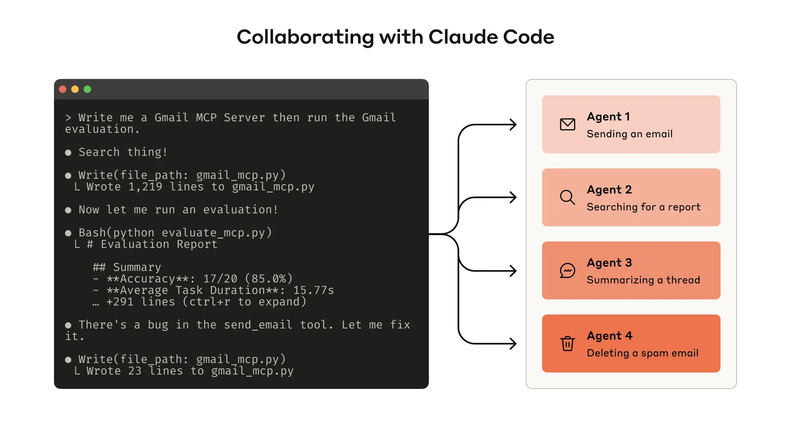
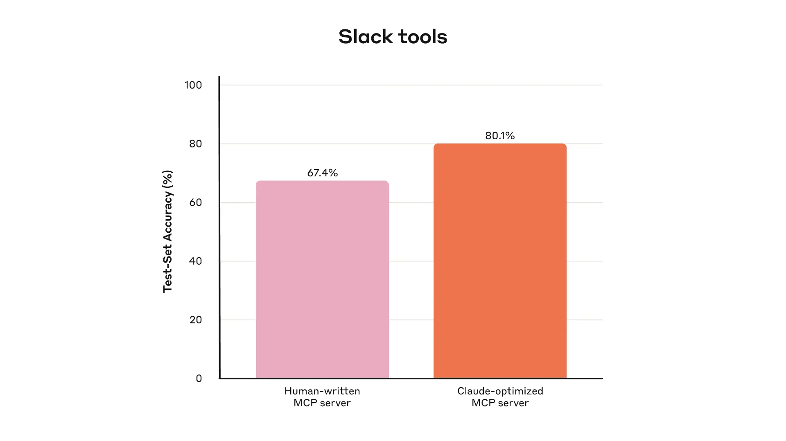
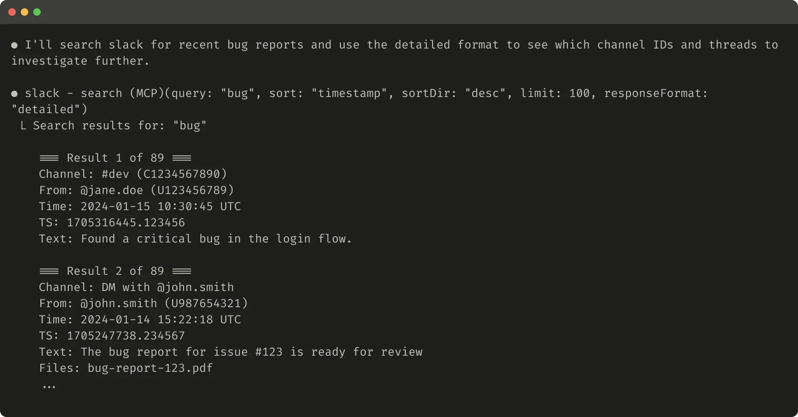
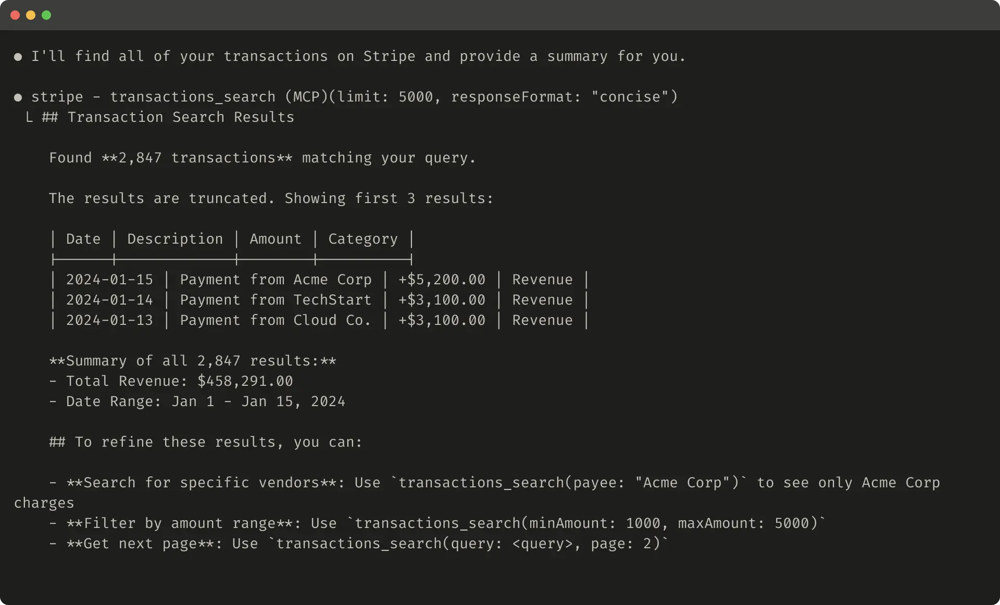
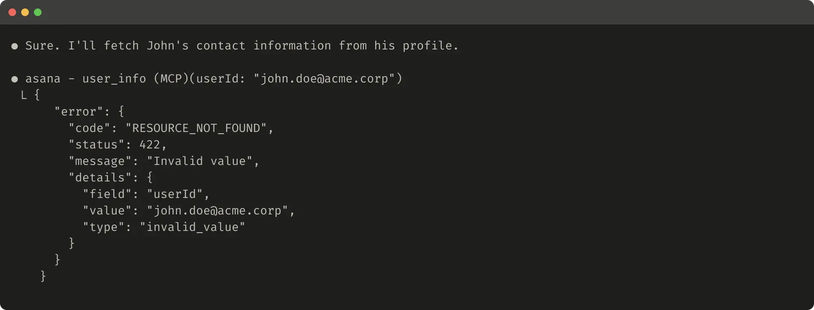

[Model Context Protocol (MCP)](https://modelcontextprotocol.io/docs/getting-started/intro) 赋予了 LLM Agent 调用成百上千种工具以解决现实任务的能力。但我们该如何确保这些工具发挥最大效能？

在这篇文章中，我们将分享在构建各种 Agentic AI 系统（代理式 AI 系统）[^1] 的过程中，为了提升性能而总结出的最高效技巧。

[^1]: 指除了训练底层 LLM 本身之外的工作。

首先，我们将探讨如何：

- 构建并测试工具的原型
- 创建并运行全面的工具评估，让 Agent 参与其中
- 与 Claude Code 等 Agent 协作，自动提升工具性能

最后，我们将总结在这一过程中识别出的编写高质量工具的关键原则：

- 甄选该实现（以及不该实现）的工具
- 利用命名空间（Namespacing）界定清晰的功能边界
- 从工具向 Agent 返回有意义的上下文
- 优化工具响应以提高 Token 效率
- 对工具描述和规范进行提示词工程（Prompt-engineering）



构建评估体系使你能系统地衡量工具的性能。你可以使用 Claude Code 根据评估结果自动优化你的工具。

## 什么是工具？

在计算领域，确定性系统在输入一致时总能产出相同的输出；而像 Agent 这样的*非确定性*系统，即便初始条件相同，也可能生成各异的反应。

传统的软件开发是在建立确定性系统之间的契约。例如，像 `getWeather(“NYC”)` 这样的函数调用，每次执行时都会以完全相同的方式获取纽约市的天气。

工具则是一种新型软件，它映射了确定性系统与非确定性 Agent 之间的契约。当用户问“今天我该带伞吗？”时，Agent 可能会调用天气工具，可能根据常识回答，甚至可能先反问具体的地点。偶尔，Agent 可能会产生幻觉，甚至无法理解如何使用某个工具。

这意味着在为 Agent 编写软件时，我们需要从根本上重构思维：不能像为其他开发者或系统编写函数和 API 那样来构建工具和 [MCP Server](https://modelcontextprotocol.io/)，而必须专门“为 Agent 而设计”。

我们的目标是扩大 Agent 的能力边界，使其能利用工具采取多种成功策略，从而有效解决广泛的任务。幸运的是，根据我们的经验，那些对 Agent 来说最“符合人体工学”（ergonomic）的工具，往往对人类来说也出奇地直观易懂。

## 如何编写工具

本节将介绍如何与 Agent 协作，共同编写和改进工具。首先，快速搭建工具原型并在本地测试。接着，运行全面的评估来衡量后续变更的影响。通过与 Agent 并肩工作，你可以不断重复评估和改进的过程，直到你的 Agent 在处理现实任务时达到卓越的性能。

### 构建原型

如果不亲自上手，很难预判哪些工具对 Agent 来说是“顺手”的，哪些不是。请从快速搭建工具原型开始。如果你使用 [Claude Code](https://www.anthropic.com/claude-code) 来编写工具（可能是一次性生成的），建议向 Claude 提供工具所依赖的任何软件库、API 或 SDK 的文档（包括可能的 [MCP SDK](https://modelcontextprotocol.io/docs/sdk)）。LLM 友好的文档通常可以在官方文档站点的扁平化 `llms.txt` 文件中找到（这是我们的 [API 文档](https://docs.anthropic.com/llms.txt)）。

将你的工具封装在 [本地 MCP Server](https://modelcontextprotocol.io/docs/develop/connect-local-servers) 或 [Desktop extension](https://www.anthropic.com/engineering/desktop-extensions) (DXT) 中，可以让你在 Claude Code 或 Claude Desktop 应用程序中连接并测试它们。

要将本地 MCP Server 连接到 Claude Code，请运行 `claude mcp add <name> <command> [args...]`。

要将本地 MCP Server 或 DXT 连接到 Claude Desktop 应用程序，请分别导航至 `Settings > Developer` 或 `Settings > Extensions`。

工具也可以直接传入 [Anthropic API](https://docs.anthropic.com/en/docs/agents-and-tools/tool-use/overview) 调用中进行程序化测试。

亲自测试工具以识别粗糙之处。收集用户反馈，建立对工具预期用例和提示词（Prompts）的直觉。

### 运行评估

接下来，你需要通过运行评估来衡量 Claude 使用你工具的效果。首先，生成大量基于现实用途的评估任务。我们建议与 Agent 合作来分析结果，并确定改进工具的方向。你可以参考我们的 [工具评估手册](https://github.com/anthropics/anthropic-cookbook/blob/main/tool_evaluation/tool_evaluation.ipynb) 查看这一端到端的过程。



我们内部 Slack 工具的留出测试集（Held-out test set）性能表现

**生成评估任务**

利用早期原型，Claude Code 可以快速探索你的工具并创建数十个提示词与响应对（Prompt and response pairs）。提示词应源于真实世界的用途，并基于真实的数据源和服务（例如内部知识库和微服务）。我们建议避免过于简单或肤浅的“沙盒”环境，因为它们无法以足够的复杂度对工具进行压力测试。强有力的评估任务可能需要多次工具调用——甚至数十次。

以下是一些强任务的示例：

- 安排下周与 Jane 开会讨论最新的 Acme Corp 项目。附上我们上次项目规划会议的笔记，并预订一间会议室。
- 客户 ID 9182 报告称单次购买尝试被扣款三次。查找所有相关日志条目，并确定是否有其他客户受到同一问题的影响。
- 客户 Sarah Chen 刚刚提交了取消请求。准备一份挽留方案。请确定：(1) 她离开的原因，(2) 哪种挽留方案最具吸引力，以及 (3) 在提出方案前我们需要注意的任何风险因素。

以下是一些较弱的任务：

- 安排下周与 `jane@acme.corp` 的会议。
- 在支付日志中搜索 `purchase_complete` 和 `customer_id=9182`。
- 查找客户 ID 45892 的取消请求。

每个评估提示词都应配有一个可验证的响应或结果。验证器可以简单到只是对比基准真相（Ground truth）与采样响应的字符串是否完全匹配，也可以高级到利用 Claude 来评判响应质量。避免使用过于严格的验证器，以免因格式、标点或合理的措辞差异等细枝末节而拒绝正确的响应。

对于每个提示词-响应对，你还可以选择指定你期望 Agent 在解决任务时调用的工具，以衡量 Agent 在评估过程中是否成功领会了每个工具的用途。但是，由于正确解决任务可能存在多条有效路径，请尽量避免过度指定或对特定策略过拟合。

**运行评估**

我们建议通过直接的 LLM API 调用以编程方式运行评估。使用简单的 Agent 循环（包裹交替 LLM API 和工具调用的 `while` 循环）：每个评估任务一个循环。每个评估 Agent 应被赋予单个任务提示词和你的工具集。

在评估 Agent 的系统提示词（System Prompts）中，我们建议不仅指示 Agent 输出结构化的响应块（用于验证），还要输出推理和反馈块。指示 Agent 在工具调用和响应块*之前*输出这些内容，可以通过触发思维链（Chain-of-Thought, CoT）行为来提升 LLM 的有效智能。

如果你使用 Claude 进行评估，可以直接开启 [交替思考 (Interleaved Thinking)](https://docs.anthropic.com/en/docs/build-with-claude/extended-thinking#interleaved-thinking) 来获得类似的“开箱即用”功能。这将帮助你探究 Agent 为何调用或不调用某些工具，并突显工具描述和规范中具体的改进领域。

除了顶层准确率外，我们建议收集其他指标，如单个工具调用和任务的总运行时长、工具调用总数、Token 总消耗量以及工具错误。跟踪工具调用有助于揭示 Agent 遵循的常见工作流，并为工具整合提供机会。


我们内部 Asana 工具的留出测试集性能表现

**分析结果**

Agent 是你的得力助手，能帮你发现问题并提供反馈——从相互矛盾的工具描述到低效的工具实现，再到令人困惑的工具架构（Schemas）。然而，请记住，Agent 在反馈和响应中遗漏的内容往往比包含的内容更重要。LLM 并不总是[言尽其意](https://www.anthropic.com/research/tracing-thoughts-language-model)。

观察你的 Agent 在何处受阻或感到困惑。通读评估 Agent 的推理和反馈（或 CoT）以识别粗糙边缘。审查原始记录（Transcripts），包括工具调用和工具响应，以捕捉任何未在 Agent CoT 中明确描述的行为。要学会读懂字里行间；切记，你的评估 Agent 并不一定知道正确的答案和策略。

分析你的工具调用指标。大量的冗余工具调用可能意味着需要调整分页或 Token 限制参数；因参数无效而导致的大量工具错误可能意味着工具需要更清晰的描述或更好的示例。当我们推出 Claude 的 [Web Search 工具](https://www.anthropic.com/news/web-search)时，我们发现 Claude 不必要地在工具的 `query` 参数后附加了 `2025`，导致搜索结果出现偏差并降低了性能（我们通过改进工具描述引导 Claude 走上了正轨）。

### 与 Agent 协作

你甚至可以让 Agent 分析结果并为你改进工具。只需将评估 Agent 的记录（Transcripts）拼接起来并粘贴到 Claude Code 中。Claude 是分析记录和一次性重构大量工具的专家——例如，确保在进行新更改时，工具实现和描述保持自洽。

实际上，本文中的大部分建议都源自我们使用 Claude Code 反复优化内部工具实现的经验。我们的评估建立在内部工作区之上，反映了我们内部工作流的复杂性，涵盖了真实的项目、文档和消息。

我们依赖留出测试集（Held-out test sets）来确保没有对“训练”评估产生过拟合。这些测试集表明，即使是面对由我们的研究人员手动编写或由 Claude 自身生成的“专家级”工具实现，我们仍能挖掘出额外的性能提升空间。

在下一节中，我们将分享从这一过程中学到的一些经验。

## 编写高效工具的原则

在本节中，我们将把学到的经验提炼为编写高效工具的几条指导原则。

### 为 Agent 选择正确的工具

工具并非越多越好。我们观察到的一个常见错误是，工具仅仅是对现有软件功能或 API 端点的简单封装——而未考虑这些工具是否适合 Agent。这是因为 Agent 拥有与传统软件截然不同的“可供性”（Affordances）——也就是说，它们感知利用这些工具所能采取的潜在行动的方式是不同的。

LLM Agent 的“上下文”是有限的（即它们一次能处理的信息量有限），而计算机内存则是廉价且充裕的。考虑在地址簿中搜索联系人的任务。传统软件程序可以高效地存储并逐个处理联系人列表，检查完一个再移至下一个。

然而，如果 LLM Agent 使用的工具返回了**所有**联系人，然后不得不逐个 Token 地阅读，那它就在无关信息上浪费了宝贵的上下文空间（想象一下，为了查一个电话，从头到尾把电话簿每一页都读一遍——这就是暴力搜索）。对 Agent 和人类来说，更好且更自然的方法是直接跳到相关页面（比如按字母顺序查找）。

我们建议构建少量针对特定高影响力工作流的精心设计的工具，使其与评估任务相匹配，然后再逐步扩展。在地址簿的例子中，你可能会选择实现 `Contactss` 或 `message_contact` 工具，而不是 `list_contacts` 工具。

工具可以整合功能，在底层处理潜在的*多个*离散操作（或 API 调用）。例如，工具可以用相关元数据丰富工具响应，或在一个工具调用中处理频繁串联的多步骤任务。

以下是一些示例：

- 不要实现 `list_users`、`list_events` 和 `create_event` 这一堆工具，考虑实现一个 `schedule_event` 工具，它能查找可用时间并安排活动。
- 不要实现 `read_logs` 工具，考虑实现一个 `search_logs` 工具，它只返回相关的日志行和周围的一些上下文。
- 不要实现 `get_customer_by_id`、`list_transactions` 和 `list_notes` 这一堆工具，实现一个 `get_customer_context` 工具，一次性汇编该客户所有近期且相关的信息。

确保你构建的每个工具都有清晰、独特的目标。工具应使 Agent 能够像人类在拥有相同底层资源时那样拆分和解决任务，同时减少那些本会被中间输出消耗掉的上下文。

过多的工具或重叠的工具也会分散 Agent 追求高效策略的注意力。审慎、有选择地规划你构建（或不构建）的工具，将会带来真正的回报。

### 工具的命名空间 (Namespacing)

你的 AI Agent 可能会获得访问数十个 MCP Server 和数百种不同工具的权限——包括由其他开发者开发的工具。当工具功能重叠或目标模糊时，Agent 可能会在选择使用哪个工具时感到困惑。

命名空间（将相关工具归类在共同前缀下）有助于划清大量工具之间的界限；MCP 客户端有时会默认执行此操作。例如，按服务（如 `asana_search`、`jira_search`）和资源（如 `asana_projects_search`、`asana_users_search`）对工具进行命名空间划分，可以帮助 Agent 在正确的时间选择正确的工具。

我们发现，选择基于前缀还是基于后缀的命名空间对工具使用评估有不容忽视的影响。这种影响因 LLM 而异，建议你根据自己的评估结果选择命名方案。

Agent 可能会调用错误的工具，用错误的参数调用正确的工具，调用的工具太少，或错误地处理工具响应。通过有选择地实现那些名称能反映任务自然细分的工具，你可以同时减少加载到 Agent 上下文中的工具数量和描述，并将 Agent 式的计算负担从上下文转移回工具调用本身。这降低了 Agent 犯错的整体风险。

### 从工具返回有意义的上下文

同样地，工具实现应注意只向 Agent 返回高信噪比的信息。它们应优先考虑上下文的相关性而非灵活性，并摒弃低级的技术标识符（例如：`uuid`、`256px_image_url`、`mime_type`）。像 `name`、`image_url` 和 `file_type` 这样的字段更有可能直接指导 Agent 的下游行动和响应。

Agent 处理自然语言名称、术语或标识符的能力也明显优于处理晦涩难懂的标识符。我们发现，仅仅将任意的字母数字 UUID 解析为语义更丰富、更易解释的语言（甚至是从 0 开始的索引方案），就能通过减少幻觉显著提高 Claude 在检索任务中的精度。

在某些情况下，Agent 可能需要同时与自然语言和技术标识符输出进行交互的灵活性，哪怕只是为了触发下游工具调用（例如，`search_user(name='jane')` → `send_message(id=12345)`）。你可以通过在工具中暴露一个简单的 `response_format` 枚举参数来同时支持两者，允许 Agent 控制工具是返回 `“concise”`（简洁）还是 `“detailed”`（详细）的响应（见下图）。

你可以添加更多格式以获得更大的灵活性，类似于 GraphQL，你可以精确选择想要接收哪些信息片段。以下是一个控制工具响应详细程度的 ResponseFormat 枚举示例：

```graphql
enum ResponseFormat {
   DETAILED = "detailed",
   CONCISE = "concise"
}
```

这是一个详细工具响应的示例（206 Tokens）：



该代码片段展示了一个详细工具响应的示例。

这是一个简洁工具响应的示例（72 Tokens）：

甚至你的工具响应结构——例如 XML、JSON 或 Markdown——也会对评估性能产生影响：没有放之四海而皆准的解决方案。这是因为 LLM 是基于“下一个 Token 预测”进行训练的，往往在格式与其训练数据匹配时表现更好。最佳响应结构将因任务和 Agent 而异。我们鼓励你根据自己的评估选择最佳的响应结构。

### 优化工具响应以提高 Token 效率

优化上下文的质量很重要，优化工具响应返回的上下文*数量*同样关键。

对于任何可能占用大量上下文的工具响应，我们建议结合使用分页、范围选择、过滤和/或截断，并设置合理的默认参数值。对于 Claude Code，我们默认将工具响应限制在 25,000 个 Token 以内。我们预计 Agent 的有效上下文长度会随着时间推移而增长，但对上下文高效工具的需求将始终存在。

如果你选择截断响应，请务必用有帮助的说明来引导 Agent。你可以直接鼓励 Agent 采取更节省 Token 的策略，比如在知识检索任务中进行多次小范围的针对性搜索，而不是一次广泛的搜索。同样，如果工具调用引发错误（例如在输入验证期间），你可以对错误响应进行提示词工程，清晰地传达具体的、可操作的改进建议，而不是返回不透明的错误代码或堆栈跟踪（tracebacks）。

这是一个被截断的工具响应示例：



该图展示了一个被截断的工具响应示例。

这是一个无助益的错误响应示例：



该图展示了一个无助益的工具响应示例。

这是一个有助益的错误响应示例：

### 对工具描述进行提示词工程

我们现在谈到了改进工具最有效的方法之一：对工具描述和规范进行提示词工程（Prompt-engineering）。因为这些内容会被加载到 Agent 的上下文中，它们能共同引导 Agent 展现出有效的工具调用行为。

在编写工具描述和规范时，请想象你正在向团队中的新员工介绍这个工具。把你脑海中隐性的上下文——特定的查询格式、利基术语的定义、底层资源间的关系——全部显性化。通过清晰描述（并使用严格的数据模型强制执行）预期的输入和输出，避免歧义。特别是，输入参数的命名应毫无歧义：与其使用名为 `user` 的参数，不如使用 `user_id`。

通过评估，你可以更自信地衡量提示词工程的影响。即使是对工具描述的微小改进也能产生巨大的提升。在对工具描述进行精确优化后，Claude Sonnet 3.5 在 [SWE-bench Verified](https://www.anthropic.com/engineering/swe-bench-sonnet) 评估中实现了最先进的性能，显著降低了错误率并提高了任务完成率。

你可以在我们的 [开发者指南](https://docs.anthropic.com/en/docs/agents-and-tools/tool-use/implement-tool-use#best-practices-for-tool-definitions) 中找到更多关于工具定义的最佳实践。如果你正在为 Claude 构建工具，我们还建议阅读有关工具如何动态加载到 Claude [系统提示词](https://docs.anthropic.com/en/docs/agents-and-tools/tool-use/implement-tool-use#tool-use-system-prompt) 中的内容。最后，如果你正在为 MCP Server 编写工具，[工具注解 (Tool Annotations)](https://modelcontextprotocol.io/specification/2025-06-18/server/tools) 有助于披露哪些工具需要开放世界访问权限或会进行破坏性更改。

## 展望未来

为了构建高效的 Agent 工具，我们需要将软件开发实践从可预测的、确定性的模式，重新定位为非确定性的模式。

通过本文描述的迭代式、以评估为驱动的流程，我们识别出了使工具获得成功的连贯模式：高效的工具拥有目标明确且清晰的定义，审慎地使用 Agent 上下文，可以在多样化的工作流中组合使用，并使 Agent 能够直观地解决现实世界的任务。

未来，我们预计 Agent 与世界交互的具体机制将不断演变——从 MCP 协议的更新到底层 LLM 本身的升级。通过采用系统的、以评估为驱动的方法来改进 Agent 工具，我们可以确保随着 Agent 能力的增强，它们所使用的工具也将与之同步进化。

## 致谢

本文由 Ken Aizawa 撰写，感谢来自 Research (Barry Zhang, Zachary Witten, Daniel Jiang, Sami Al-Sheikh, Matt Bell, Maggie Vo), MCP (Theodora Chu, John Welsh, David Soria Parra, Adam Jones), Product Engineering (Santiago Seira), Marketing (Molly Vorwerck), Design (Drew Roper), 以及 Applied AI (Christian Ryan, Alexander Bricken) 团队同事的宝贵贡献。
